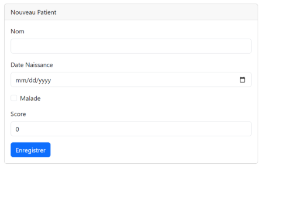
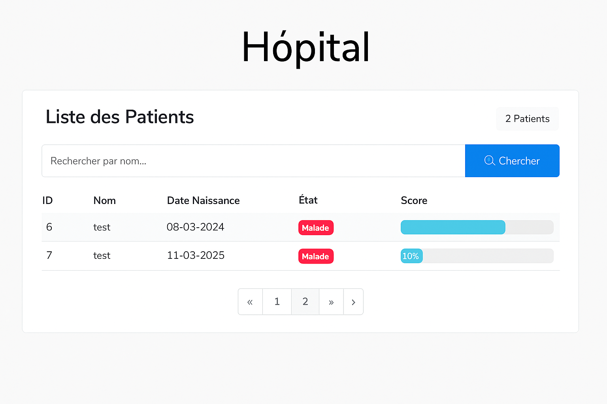

# Hospital Management System

A comprehensive web-based hospital management system built with Spring Boot and Thymeleaf.

##  Screenshots




##  Features

- Patient Management
- Medical Records
- User-friendly Interface
- Responsive Design
- Real-time Data Updates

##  Technologies Used

- Java 17
- Spring Boot 3.4.3
- Spring Data JPA
- Thymeleaf
- MySQL Database
- Bootstrap 5.3.3
- jQuery 3.7.1
- Lombok
- Maven

##  Prerequisites

- JDK 17 or higher
- Maven
- MySQL Server
- Your favorite IDE (IntelliJ IDEA, Eclipse, etc.)

##  Getting Started

1. Clone the repository:
```bash
git clone https://github.com/Ouma49/Management_of_patients.git
```

2. Configure your database:
   - Create a MySQL database
   - Update the `application.properties` file with your database credentials

3. Build the project:
```bash
mvn clean install
```

4. Run the application:
```bash
mvn spring-boot:run
```

5. Access the application at `http://localhost:8080`

##  Project Structure

```
src/
├── main/
│   ├── java/
│   │   └── ma/enset/
│   │       ├── controllers/
│   │       ├── entities/
│   │       ├── repositories/
│   │       └── services/
│   └── resources/
│       ├── static/
│       ├── templates/
│       └── application.properties
└── test/
```

##  Configuration

The application can be configured through `application.properties`. Key configurations include:

- Database connection settings
- Server port
- Logging levels
- Other Spring Boot configurations

##  Dependencies

Major dependencies include:
- Spring Boot Starter Web
- Spring Boot Starter Data JPA
- Spring Boot Starter Thymeleaf
- MySQL Connector
- Bootstrap
- jQuery
- Lombok


##  Authors

- DAOUDI Oumayma
- GLSID 2
